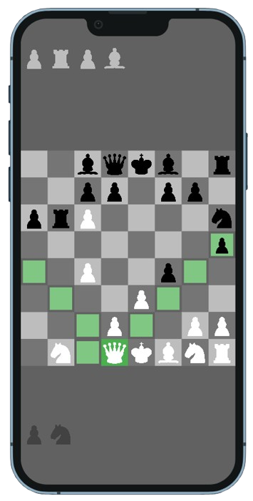

# ♟️ Flutter Chess Game  

A **beautiful and fully functional Chess game** built with Flutter. Enjoy a smooth and interactive experience with legal move validation, drag-and-drop mechanics, and multiple game modes.  

## 🎮 Features  
- 🏁 **Smooth Drag & Drop** – Easy-to-use chessboard UI  
- ✅ **Legal Move Validation** – Prevents illegal moves  
- 🎭 **Play vs AI or a Friend** – Choose single or two-player mode  
- 🔄 **Undo & Reset Game** – Improve your strategy  
- 🎨 **Elegant Chessboard Design**  

## 📱 Screenshots  


## 📥 Download APK  
🔗 [Download APK](assets/magic_chess.apk)

## 🚀 Getting Started  

### Prerequisites  
- Flutter SDK installed  
- Dart environment setup  

### Installation  
1. Clone this repository:  
   ```bash
   git clone https://github.com/AdityaRaj9889/chess.git
